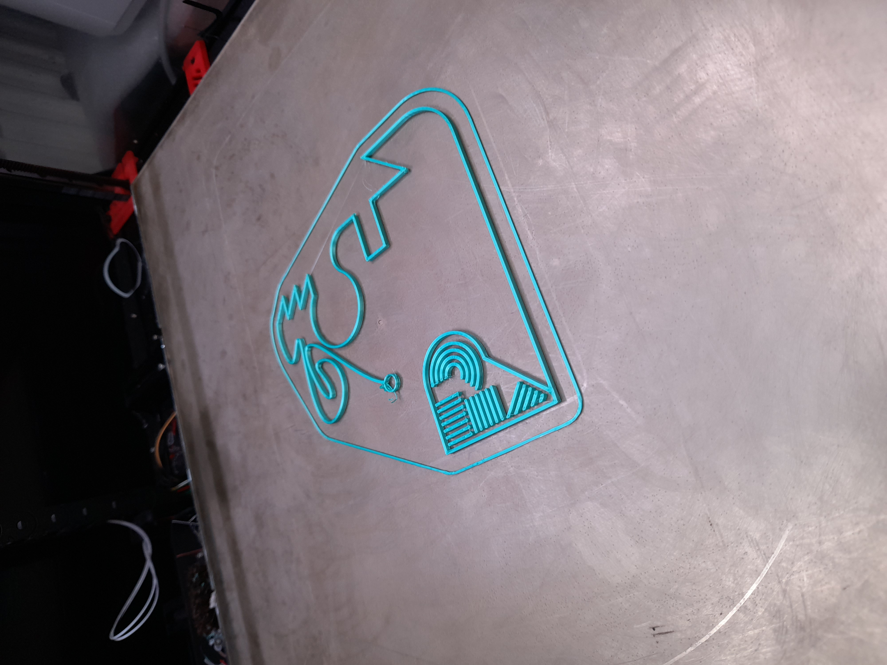
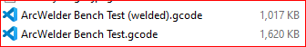

# Is Arc Welder Useful in Combination With Klipper?

## About Arc Welder

Most modern printer firmware (Klipper, Marlin) does support gcode arc commands `G2` and `G3` so there is no reason slicers can't use these commands, however, it appears to be universally true that slicers do not use this capability. Instead, they cut the curve into many tiny straight lines and issue `G1` move commands. This generates a lot of gcode.

The sheer bulk of all the gcode can be problematic in OctoPrint based systems, because the gcode pipeline passes through Octoprint and all of its plug-ins. With many plugins installed (or even a single particularly inefficient one) this can result in _buffer underrun_. In this condition, the printer runs out of work to do and simply stops, awaiting the next command. Filament continues to ooze and this results in unsightly blobs in the print.

**Arc Welder** addresses this problem by post-processing the slicer-generated gcode, detecting series of small movements that approximate curves, and converting them to gcode arc commands `G2` and `G3`. Thus, many small `G1` commands are replaced by a single `G2` or `G3` command, reducing the amount of gcode that has to be stored, parsed and processed.

## To Weld, or Not to Weld

Arc Welder has found popularity with OctoPrint users and deservedly so. It is a well-written and easy-to-use plug-in that solves a real-world problem.

Klipper users, however, shun Arc Welder on the basis that "it doesn't make any difference". The argument is that, ultimately, all arcs are printed as a series of straight lines. The substitution either happens in the slicer, or in the printer firmware, but it always happens. While it holds true that fewer lines of gcode are parsed, Klipper internally converts arc commands into a series of `G1` commands then processes those as if they had come from the gcode file. Klipper users believe that Klipper is fast enough to cope with many small moves and therefore using ArcWelder is pointless.


## An Objective Test

The Klipper users' claim has merit, but is based on assumption and intuition. We have never seen any evidence produced to back this up. Therefore, we wanted to make an objective assessment of whether the use of Arc Welder does have any effect when used with Klipper.

We used SuperSlicer to slice the following model using our normal high-speed print profile, which uses a 0.4mm nozzle, 0.2mm layer height, and _auto-speed_ mode based on a filament flow rate of 24 mm³/s and a maximum speed limit of 240 mm/s. We set the model height to 2.1mm, allowing for 1 x 0.3mm first layer and 9 x 0.2mm layers, for a total of 10 layers. The print time was approximately 9 minutes measured from the first extrusion onto the bed.


The model printed as follows:



Note that solid infill areas did not print because they are 0.2mm tall and we use a 0.3mm first layer height. The slicer therefore chose to ignore the solid infill. Since the effect was the same for both tests, we did not feel that this had any impact on the results and did not attempt to correct this.

Arc Welder has a command-line version, which can be added to the print profile in SuperSlicer as a _gcode post-processor_ or simply run from a command line console. We configured our print profile with the following commands:

> F:\OneDrive\Programs\ArcWelder-Console\bin\ArcWelder.exe --progress-type=FULL --allow-dynamic-precision --allow-travel-arcs --allow-3d-arcs ;

We performed one print without this command in place and one print with it in place, keeping all other settings identical. We also ran the processor from the command line to asses file sizes and capture statistics.

We timed the prints and analyzed the resulting gcode file sizes. Timing was from the first deposition of filament onto thte print bed (so excluding the start-up routine and preheat times) to the moment the print head pulled away from the model at the end of the print. Timing should be accurate to better than 1 second.

## Results

The results obtained were as follows.

### Files sizes

The gcode file sizes generated were:



The post-processed file was significantly smaller than the unprocessed file.

### Gcode Comparison

An analysis of the resulting gcode files shows exactly how Arc Welder achieves this result. A small segment of the unprocessed gcode file is shown here:

```lang=gcode
G1 X172.94 Y205.991 E0.33792 ; External perimeter
G1 X173.02 Y206.066 E0.00691 ; External perimeter
G1 X175.018 Y207.983 E0.17384 ; External perimeter
G1 X175.294 Y208.251 E0.02414 ; External perimeter
G1 X175.562 Y208.511 E0.02345 ; External perimeter
G1 X176.156 Y209.104 E0.05274 ; External perimeter
G1 X176.751 Y209.697 E0.05274 ; External perimeter
G1 X176.866 Y209.815 E0.01031 ; External perimeter
G1 X176.98 Y209.933 E0.01031 ; External perimeter
G1 X177.428 Y210.397 E0.0405 ; External perimeter
G1 X177.875 Y210.862 E0.0405 ; External perimeter
G1 X177.892 Y210.881 E0.00161 ; External perimeter
```

Using file comparison tools, the equivalent segment in the post-processed file can be identified as:

```lang=gcode
G3 X177.892 Y210.881 I-149.248 J163.697 E0.77497; External perimeter
```

Thus it can be seen that Arc Welder has condensed twelve `G1` move commands into a single `G3` counter-clockwise arc command.

### Post-processing Statistics

Arc Welder produced the following output when run on the command line:

<pre>
+---------------------------------------------+
|      Target File Extrusion Statistics       |
+---------------------------------------------+
|   Min          Max     Source  Target Change|
+---------------------------------------------+
|  0.000mm to   0.002mm       0       0   0.0%|
|  0.002mm to   0.005mm       0       0   0.0%|
|  0.005mm to   0.010mm       0       0   0.0%|
|  0.010mm to   0.050mm      64       1 -98.4%|
|  0.050mm to   0.100mm    1058     828 -21.7%|
|  0.100mm to   0.500mm    9392    1386 -85.2%|
|  0.500mm to   1.000mm    7170    3159 -55.9%|
|  1.000mm to   5.000mm    5185    3426 -33.9%|
|  5.000mm to  10.000mm     273     526  92.7%|
| 10.000mm to  20.000mm     624     862  38.1%|
| 20.000mm to  50.000mm     160     214  33.8%|
| 50.000mm to 100.000mm      44      46   4.5%|
|          >= 100.000mm       6       6   0.0%|
+---------------------------------------------+
|Total distance source:............34886.061mm|
|Total distance target:............34886.531mm|
|   Total count source:..................23976|
|   Total count target:..................10454|
| Total percent change:.................-56.4%|
+---------------------------------------------+
</pre>

As expected, the majority of short straight lines under 5mm have been converted into curves, while (interestingly) there was a proliferation in longer lines. The total length printed is within half a millimeter overall, but the number of print operations is reduced by more than half, explaining the decrease in file size.

### Timings

Based on time stamps in Arc Welder's console log output, the post-processing took around 713 milliseconds.

Print times (as timed with a stopwatch) and filament use (taken from Mainsail print history) were as follows:

Test Case          | Print Time | Filament Used | Gcode size
-------------------|------------|--------------:|-----------:
With ArcWelder     | 09:13.97   |       1146 mm | 1017 Kb
Without ArcWelder  | 09:38.88   |       1147 mm | 1620 Kb

As expected and prediced by Arc Welder, the total extrusion length differed by less than 1 mm, suggesting that the printed results should be nearly identical.

Interestingly, the "welded" version printed 25 seconds faster. Over the duration of a 9.5 minute (570 seconds) print, that's approaching a 5% speed increase overall, which could be significant for a large print.

## Conclusions

The main conclusions drawn are:

- Arc Welder does not significantly alter the printed results
- Arc welder significantly reduces the size of generated gcode files
- Arc Welder does not significantly alter the amount of filament used
- Files processed by Arc Welder appear to print faster by about 5%.

The last conclusion is puzzling, but undeniable. We cannot see any reason why Arc Welded files should print faster, since Klipper is literally converting them to `G1` move commands internally.

One possible explanation for this is that Klipper could be using a different resolution than the slicer when creating the straight-line approximation. The Klipper default is to use 1 mm line segments, but we have set this to 0.1 mm in our printer configuration.

An analysis of the gcode sample shown under [gcode comparison](#gcode-comparison) suggests that SuperSlicer is generating line segments as follows.

Start X  | Start Y  | End X   | End Y    | Delta X | Delta Y  | Segment length
--------:|---------:|--------:|---------:|--------:|---------:|----------------:
 172.940 |  205.991 | 173.020 |  206.066 |   0.080 |    0.166 |          0.184  
 173.020 |  206.066 | 175.018 |  207.983 |   1.998 |    1.917 |          2.769
 175.018 |  207.983 | 175.294 |  208.251 |   0.276 |    0.268 |          0.385
 175.294 |  208.251 | 175.562 |  208.511 |   0.268 |    0.260 |          0.373

 From the randomly chosen section of file analyzed above, it does not seem like SuperSlicer is generating particularly short line segments. The longest segment above is more than 2 mm, double Klipper's default and more than 20 times the configured setting in our Klipper configuration. It is also interesting that the line segments are not consistent in length.

 There is no clear evidence that Klipper is gaining speed advantage by generating longer line segments. Admittedly this conclusion is based on a very superficial analysis and further investigation may be warranted.

## Summary

While the advantage of using Arc Welder is clearly reduced compared to when using OctoPrint, it is not zero when used with Klipper.
This holds true even though the Klipper default line segment length has been reduced by an order of magnitude.
The Arc Welder post-processed gcode produced a much smaller gcode file and a somewhat faster print time.
The cost of these optimizations is relatively small and is paid when the gcode is exported from the slicer.

The often-claimed "it doesn't make any difference with Klipper" is clearly not correct. There are measurable and significant differences between processed and unprocessed gcode.

Whether the difference is large enough to be of value is subjective, and must be left to the reader to decide.
