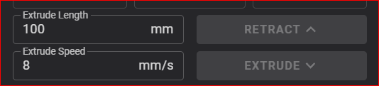
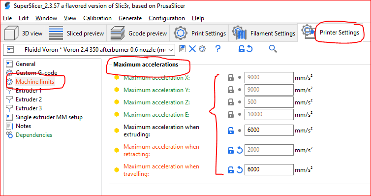
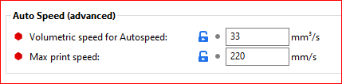
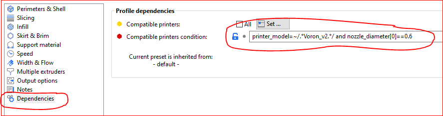
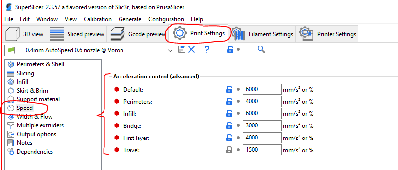
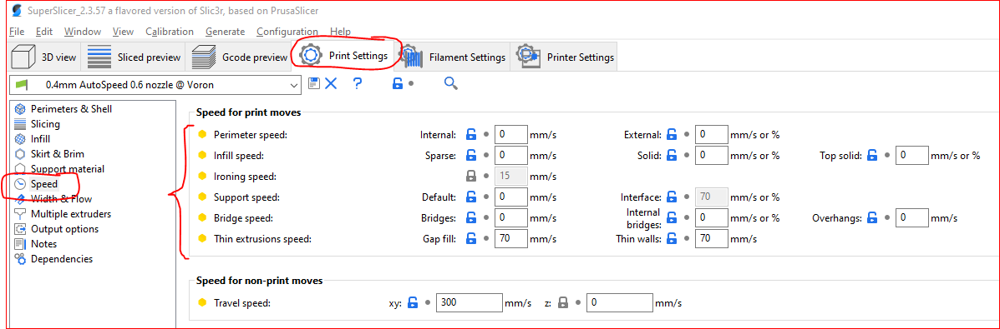
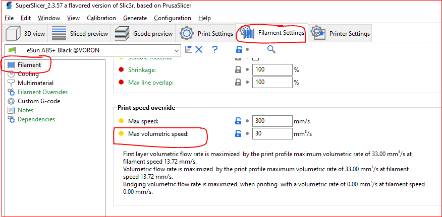
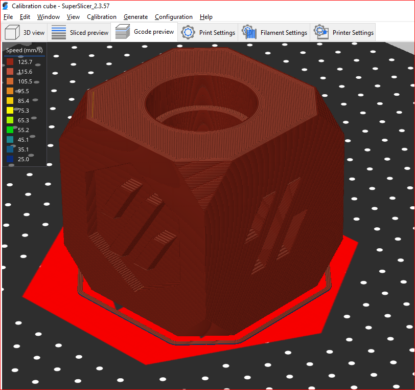

# Why "How Fast Can I Print?" is the wrong question

People often ask, "What's my maximum print speed?". They also assume that lower speed means better print quality, but this is misguided. It is a natural question, but physics is sometimes counterintuitive and I think that speed is the wrong thing to focus on. Here, I will present my thinking.

## Limitations on Print Speed

What are the limitations on print speed? In my view they are twofold:

1. How fast can the extruder reliably melt and push out the plastic - your _Maximum Volumetric Flow Rate_.
2. What forces can the printer frame and kinematics (including the belts and motors) withstand, while still giving acceptable results?

The first is directly measurable while the second is somewhat subjective and depends what your idea of "acceptable results" is. In many cases, people will have different interpretations of "acceptable" for different situations and it is common to have multiple print profiles to reflect this trade-off in print time vs. quality, eg, "Best Quality", "Balanced" and "Fast".

### Why is Speed Irrelevant?

This can be understood using classical physics and Sir Isaac Newton's laws of motion.
>**Newton's First Law**  
>Every object continues in a state of rest or uniform motion in a straight line, unless acted upon by an external force.

One implication of that law is that it takes zero force to move the print head at constant speed. That is obviously an over-simplification because there are always external forces (such as friction) acting on the system, but in essence, once a speed is achieved, it takes relatively little force to maintain it. Therefore, if a printer is capable of reaching a speed, then it can print at that speed.

The majority of force applied is needed to change the velocity of the print head, i.e. to accelerate or decelerate. Note: any change in velocity (speed and/or direction) happens as a result of an acceleration, which happens as a result of an applied force from the motors.

So how much force is needed?

>**Newton's Second Law**  
>The acceleration of an object depends on the mass of the object and the amount of force applied.

Put another way, `F` = `ma` (force equals mass times acceleration).

The force required to accelerate the print head with a given acceleration is directly proportional to the mass. Speed is simply not a consideration here. The force required for any acceleration depends only on the mass being accelerated.

So how high can we go with acceleration, given that it determines the force we must apply at the motors? Usually the first signs of failure will be that the motors are unable to provide the necessary force and will stall, leading to missed steps and layer shifts (or, in the case of the extruder, under-extrusion). However, print quality will usually start to suffer long before that point. Why is that?

>**Newton's Third Law**  
>Whenever one object exerts a force on a second object, the second object exerts an equal and opposite force on the first.

In other words, for every action, there is an equal and opposite reaction. When the motor pushes on the print head, the print head pushes back on the motor. The motor is attached to the frame, and the frame stands on the table, so forces are thus transferred from the moving parts of the printer, to the fixed parts, to the frame and to the workbench or table. This can cause flexure or vibrations in any of these components of the system, which will result in degraded printed results.

Printers are designed to be _rigid_ and to withstand the forces and not flex or oscillate, but they can only do so up to a certain point. As the forces increase, components will begin to elastically deform or oscillate and eventually they may deform past their elastic limit and permanently bend or break. Acceleration must be set at sensible levels that limit the forces in the printer to way below this level.

In practice, acceptable acceleration can be determined by making test prints and observing print quality. The frame and kinematics will usually withstand forces that are beyond the point where print quality becomes unacceptable.

## Maximum Volumetric Flow Rate

Volumetric flow rate is the amount of filament extruded, expressed in cubic millimeters per second. Your maximum volumetric flow rate will depend on a number of factors, such as:

- The type and brand of filament in use
- The rate at which your hot end can consistently melt the filament
- The force that your extruder is able to apply to the infeed filament
- The nozzle egress aperture 

Due to the many contributing factors, it is easiest to determine this by experiment.

### Determining Maximum Extrusion Speed

First, determine your maximum extrusion speed (`Emax`) in millimeters per second.

I measure this by manually extruding 100mm of filament at increasing flow rates, until either the extruder starts to skip, or I feel that the extrusion is inconsistent. This can be done by bringing the nozzle up to print temperature, then using the printer's UI to manually extrude filament.  In Fluidd, I do this using the Tool tab:

Then I back off a bit to give a margin for safety, and call that my maximum extrusion speed, `Emax`.

Others (such as Stefan from CNC Kitchen) have done this by weighing the extruded filament and noting when the amount extruded begins to fall off. This seems like a good objective approach to me, but unfortunately I don't have scales with high enough precision.

### Calculate Maximum Volumetric Flow Rate

Volumetric flow can be calculated from an extrusion speed and the filament diameter, like so:

$$E \textrm{ is extrusion speed in millimetres per second, e.g. 8 mm/s}$$
$$D_f \textrm{ is filament diameter, in millimeters, e.g. 1.75 mm}$$

From this, we can calculate:

$$\textrm{filament radius }r=\frac{D_f}{2}$$
$$\textrm{filament cross-sectional area } a = \pi r^2$$
$$\textrm{volumetric flow rate } V = a \times E$$
To find maximum volumetric flow rate, first find your maximum extrusion speed ($E_{max}$) by experiment. Then use the above formulae to compute $V_{max}$, your maximum volumetric flow rate.

>**Nozzle Diameter**  
>Note that nozzle diameter is not used anywhere in the computation. In practice, the results will be affected by the nozzle size, especially for smaller nozzles, because it takes more pressure to force the viscous molten filament through a smaller aperture and your extruder will need to work harder and will stall sooner. Therefore, this process is best performed for each nozzle size that you wish to use.

### Worked Example

Assume that you experimentally determine that you are able to consistently extrude at 8 mm per second, with 1.75 mm filament.

$$E = 8.0, D_f = 1.75$$
$$r = 1.75 / 2 = 0.875$$
$$a = 0.875 ^ 2 × π = 2.4053$$
$$V = 2.4053 x 8 = 19.24 mm³/s$$

## Determining Maximum Acceleration

You may measure your maximum acceleration in one of two ways.

1. Experimentally, by printing objects with different acceleration settings and observing the results. Your decision will include factors such as the appearance of the completed print, and whether the printer seems to be "comfortable" (i.e. not trying to shake itself apart or hop across the table). This is an entirely subjective decision, both in terms of what you consider to be acceptable print quality and how "comfortable" the printer is during the process. Prints should ideally be made with high maximum speed setting, or with the slicer's "auto-speed" mode in use (see later under [Slicer Settings](#Slicer_Settings)) so that speed does not become a limiting factor. Remember, speed is irrelevant, we are measuring acceleration.
2. Using Klipper's _Input Shaping_ analysis tool, which uses an inertial measurement unit (IMU) to directly measure the performance of the kinematics. AN explanation of this process is beyond the scope of this document, but the output will include a maximum recommended acceleration setting.

>**Print Quality vs. Print Time**  
>Print quality is ususally proportional to print time and, by implication, inversely proportional to acceleration and therefore speed. You will often wish to trade off print time against print quality. You will most likely want to create a number of different print profiles relecting this trade-off. It is common to have profiles for "Quality", "Fast" and "Balanced" where each profile would vary the peak acceleration to achieve the desired results. In general, more aggressive acceleration yields shorter print times but lower quality prints.

And finally, note that we have not really considered speed at any point. **Speed is the wrong thing to focus on**. What kills you is the acceleration and volumetric flow. Speed falls out of the physics as a natural consequence of these constraints.

Armed with this information, you are ready to configure your slicer software.

## Slicer Settings

Once you have determined your preferred peak acceleration and maximum volumetric flow rate, you are ready to configure the slicer.

I recommend SuperSlicer [^ss] for this because it has an "Auto-Speed" mode that lets you ignore print speed altogether. You set the acceleration and volumentric flow rate and SuperSlicer determines all print speeds. Other slicers may also have this capability, but I have not tested them.

### Machine Limits

First, we need to make some global printer settings. In the `Printer Settings` -> `Machine Limits` -> `Maximum accelerations` pane, make sure you;ve entered your absolute highest accelerations. This is used both for print speed estimation, and as a safety limit when generating gcode.

### Print Settings Profile

In your print profile, under `Print Settings`->`Speed`->`Auto Speed (advanced)`, enter your calculated maximum volumetric flow rate. If you have calculated different values for different filaments, put your highest value here. You can also add a maximum print speed here and this should be the highest speed that you will allow the auto-speed algorithm to use. I usually set this rather high because I expect the auto-speed algorithm to use speeds based on my acceleration settings and there's no need to really limit the speed here.

>**Make these settings dependent on the nozzle size**.  
>As maximum volumetric flow rate depends somewhat on nozzle diameter, make sure your print settings profiles depend on a printer profile with a specific nozzle size. You can define dependencies under `Print Settings`->`Dependencies`. There are a number of ways to do this, but I usually do it by directly referencing the nozzle size setting in `Compatible printers conditions` as shown here:
>

Next, set your accelerations under `Print Settings`->`Speed`->`Acceleration control (advanced)`. I like to set lower accelerations where quality really matters, such as in the permeters, while using higher accelerations for infill. You might want to create spearate print profiles with more or less aggressive accelerations depending on how you wish to trade quality for print time.

And finally, enable auto-speed mode by setting most of the speeds to zero.

>**Warning - Don't set `Gap Fill` and `Thin Walls` to zero**  
>For reasons I don't fully understand, the auto-speed calculations go a bit crazy if `Gap Fill` and `Thin Walls` are set to zero. The auto-speed algorithm appears to be completely derailed if you allow it to compute these speeds. I reported this as a bug, but the author of SuperSlicer insists that it is working as designed. I still do not understand why this is the case, and I have decided to simply accept it and not set these settings to zero.

### Filament Settings

The final step is to adjust the maximum volumetric flow rate for each type and brand of filament. In your filament profiles, under `Filament Settings`->`Filament`->`Print speed override`. Add the maximum volumetric speed that you have determined experimentally for that filament, and optionally a print speed limit.

>The auto-speed algorithm uses the _lesser_ of the values specified in the filament settings and in the print profile settings. Thus in the print profile you should have entered your _maximum volumetric flow rate_ and you can then set lower values for filaments that extrude slower. ABS typically extrudes fast, PLA and PETG moderately fast, while flexibles such as TPU will need much lower values.

### Sanity Check

Slice an object and examine the `Gcode Preview` window to assess the results. Set the `View` drop-down to `Speed` to see the print speeds that have been calculated.

>**Note: Print speeds will be limited by acceleration**  
>The preview shows the target print speed, but in practice most extrusions will be limited by acceleration.

### Print, Assess, Tweak

Print an object and assess the print quality. If the quality is poor, reduce accelerations (not speeds) in the print settings. If the extruder skips or there is under-extrusion, reduce the `Maximum volumetric flow` in the filament settings.

[^ss]: **SuperSlicer** is a fork of **Prusa Slicer**, which in turn is a fork of **Slic3r**. SuperSlicer is kept up-to-date with the latest release of Prusa Slicer, but adds a number of additional features and slicer settings. It is popular in the Voron community because of its direct support for Klipper firmware. SuperSlicer can be obtained [from GitHub](https://github.com/supermerill/SuperSlicer).
